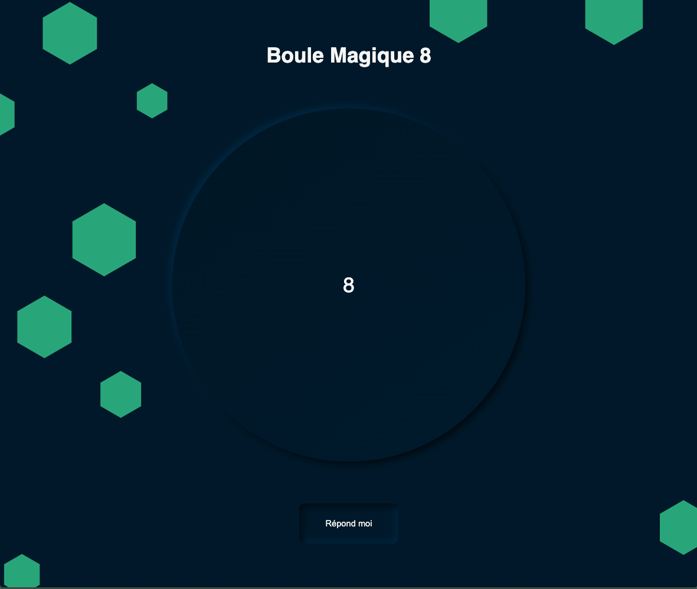

# Boule Magique 8

## Introduction
Bienvenue dans cet exercice pratique où vous allez créer votre propre **Boule Magique 8**! Cet outil de divination classique vous donnera des réponses aléatoires en réponse à vos questions. C'est une manière amusante et interactive d'apprendre les fondamentaux de la manipulation du DOM en JavaScript.

## Objectifs d'apprentissage
- **Manipulation du DOM** : Apprendre à modifier les éléments HTML en fonction des interactions de l'utilisateur.
- **addEventListener** : Utiliser les écouteurs d'événements pour rendre votre page interactive.
- **Fonctions** : Définir et appeler des fonctions pour organiser et réutiliser votre code.
- **Variables** : Utiliser des variables pour stocker et gérer les données au sein de votre programme.
- **Objet Math** : Exploiter les capacités de l'objet Math pour générer des réponses aléatoires.

## Consignes
Vous recevrez un fichier HTML et CSS pré-codés contenant le design de base de la boule magique 8. Votre tâche est de dynamiser la boule avec JavaScript en suivant ces étapes :

1. **Ajouter une écoute sur le bouton** : Faites en sorte que lorsque l'utilisateur clique sur le bouton "Réponds-moi", une fonction JavaScript soit exécutée.
2. **Générer une réponse aléatoire** : À chaque clic, une réponse aléatoire parmi 8 possibles doit apparaître au centre de la boule.
3. **Afficher la réponse** : Modifiez le DOM pour afficher la réponse générée aléatoirement dans l'élément prévu à cet effet.

## Bonus 
**Pas de Répétition Immédiate** : Modifiez le script pour s'assurer que la même réponse ne peut pas apparaître deux fois de suite. Si la réponse est la même, générez une autre réponse jusqu'à ce qu'elle soit différente.
